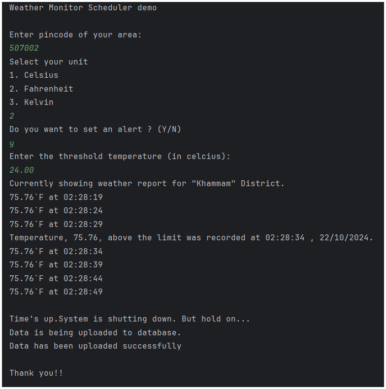

This a Real-Time Data Processing System for Weather Monitoring.

APIs used:
1. OpenWeatherMap API (https://openweathermap.org/), for getting weather info based on latitude and longitude.
2. latlong API, for getting latitude and longitude info based on pincode.

Date fetched from the API is saved in sql database for further analysis.
API request is sent periodically ( example, for every 5 minutes).

**Working picture:**

